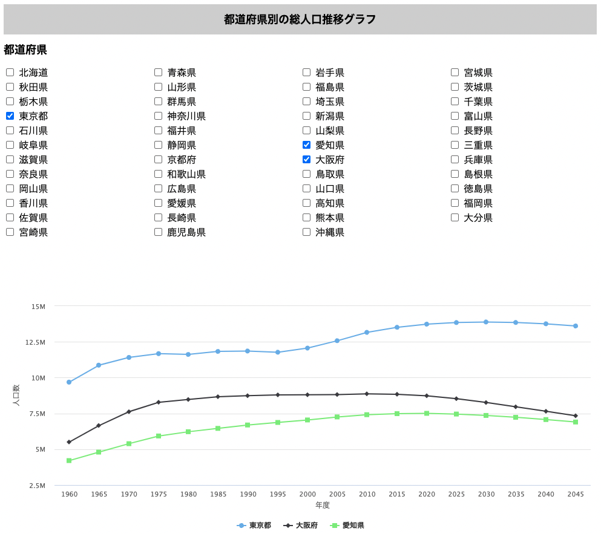

# population_graph_vue
都道府県別の総人口推移グラフを表示するSPAです。データは[RESAS API](https://opendata.resas-portal.go.jp/)のAPIから取得しています。グラフは[Highcharts](https://www.highcharts.com/)を用いて描画しています。

# デモ
https://starmine7940.github.io/population_graph_vue/

チェックボックスを押すとグラフが描画され、チェックボックスを外すとグラフが消えます。

<div align="center">
    
</div>

# 問題
グラフのデータが更新されたときに、リアクティブにグラフを再描画できませんでした。そのため、再描画のための変数draw_counterを用意し、グラフのコンポーネントにkeyとして持たせました。グラフのデータを追加・削除した際、draw_counterを1ずつ増やすことで、コンポーネントがその変化を検知して再描画しています。

## Project setup
```
npm install
```

### Compiles and hot-reloads for development
```
npm run serve
```

### Compiles and minifies for production
```
npm run build
```

### Lints and fixes files
```
npm run lint
```

### Customize configuration
See [Configuration Reference](https://cli.vuejs.org/config/).
